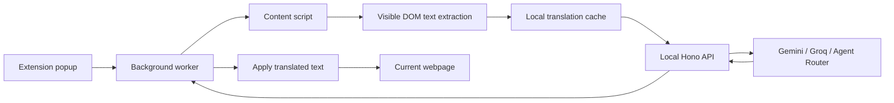

<p align="center">
  
</p>

<h1 align="center">Bdarija</h1>

<p align="center">
  <a href="https://git.io/typing-svg">
    
  </a>
</p>

<p align="center">
  <a href="https://github.com/MAHMOUDIFARID/bdarija-extension">
    
  </a>
  
  
  
</p>

<p align="center">
  A Chrome extension that scans visible webpage text and translates it into Moroccan Darija using your own AI provider key.
</p>

---

## Why Bdarija

Bdarija is built for quick personal translation experiments without committing secrets to a backend. The extension stores your provider config locally in Chrome, sends translation requests to a local Hono API, and lets you restore the original page text at any time.

## Highlights

| Area | Details |
|---|---|
| Extension | WXT, React, TypeScript, Tailwind CSS, Chrome Manifest V3 |
| Backend | Hono, Node.js, Zod validation |
| Providers | Gemini, Groq, Agent Router |
| Modes | Arabizi and Arabic-script output |
| Privacy | BYOK config stored locally in `chrome.storage.local` |
| Cache | Provider, model, mode, and source text are included in cache keys |
| Recovery | Restore original page text after translation |

## How It Works



## Quick Start

Install dependencies:

```bash
npm install
```

Start the local API:

```bash
npm run dev:api
```

Build the extension:

```bash
npm run build:extension
```

Load this folder as an unpacked Chrome extension:

```text
extension/.output/chrome-mv3
```

## BYOK Setup

1. Open the Bdarija popup.
2. Select `Gemini`, `Groq`, or `Agent Router`.
3. Paste your API key.
4. Select a model.
5. Click **Test connection**.
6. Click **Save**.
7. Open a webpage and click **Scan & Translate**.

Your key is stored locally in the browser and is only sent to the local backend for translation requests.

## Agent Router

Agent Router uses an OpenAI-compatible chat completions API.

| Setting | Value |
|---|---|
| Base URL | `https://agentrouter.org/v1` |
| Endpoint | `/chat/completions` |
| Recommended model | `gpt-5` |
| Token source | AgentRouter console token page |

Supported Agent Router model IDs:

- `gpt-5`
- `gpt-5.5`
- `gpt-5.4`
- `claude-sonnet-4-6`
- `claude-sonnet-4-5`
- `deepseek-v4-pro`
- `deepseek-v4-flash`
- `glm-5.1`
- `claude-opus-4-8`
- `claude-opus-4-7`
- `claude-opus-4-6`

Backend-only Agent Router diagnostic:

```bash
npm run test:agent-router --workspace=api
```

The diagnostic reads `AGENT_ROUTER_API_KEY` or `AGENT_ROUTER_TOKEN` from `api/.env` and prints only safe connection details.

## Environment

Create a backend `.env` only if you want fallback keys for local testing:

```bash
cp api/.env.example api/.env
```

Example:

```env
AGENT_ROUTER_API_KEY=
AGENT_ROUTER_TOKEN=
AGENT_ROUTER_BASE_URL=https://agentrouter.org/v1
GEMINI_API_KEY=
GROQ_API_KEY=
AI_API_KEY=
```

Never commit real `.env` files or API keys.

## Scripts

| Command | Description |
|---|---|
| `npm run dev:api` | Start the local API on `http://localhost:8787`. |
| `npm run dev:extension` | Start WXT development mode. |
| `npm run build:api` | Compile the API TypeScript project. |
| `npm run build:extension` | Build the Chrome MV3 extension. |
| `npm run test:agent-router --workspace=api` | Test Agent Router from the backend. |

## Project Structure

```text
.
+-- api
|   `-- src
|       +-- lib
|       +-- routes
|       +-- scripts
|       `-- services
`-- extension
    +-- entrypoints
    +-- public
    `-- src
        +-- components
        `-- lib
```

## Security Notes

- No API keys are hardcoded.
- `.env` files are ignored by Git.
- The backend never stores user-provided keys.
- Authorization headers are not logged.
- The current BYOK storage model is intended for local and personal testing.
- Production deployments should use authenticated backend sessions and proper secret management.

## License

MIT
